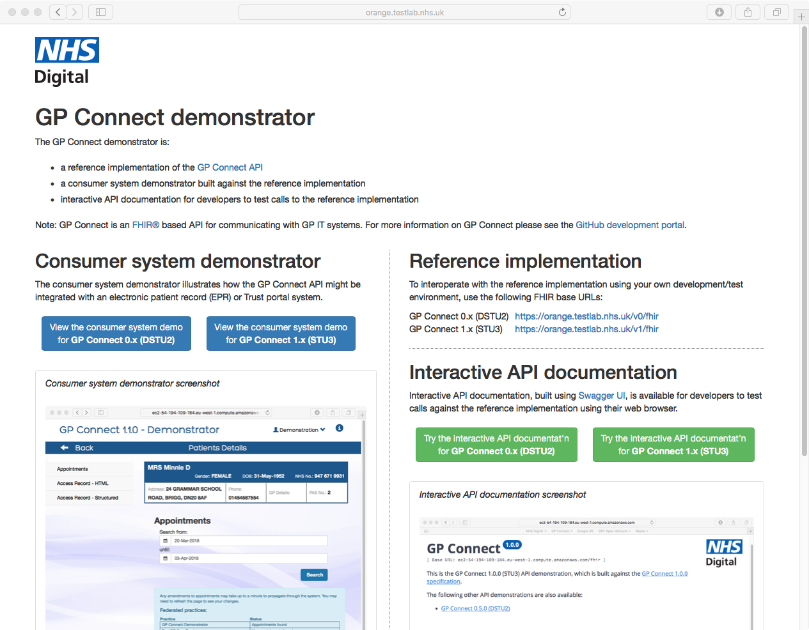

# GP Connect demonstrator machine config

This repository contains configuration and associated files for running multiple demonstrator and swagger instances from a single host.

It configures multiple versions of the following projects into a single web portal using nginx:

- https://github.com/nhsconnect/gpconnect-demonstrator
- https://github.com/nhsconnect/gpconnect-swagger

## Screenshot

